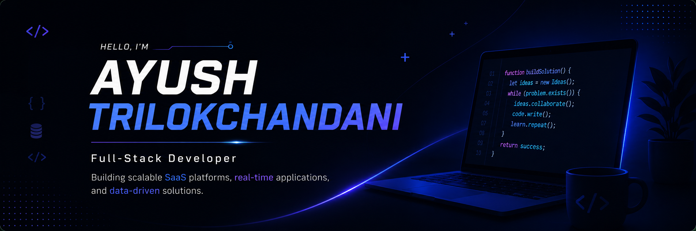

# <p align="center"></p>

<h1 align="center">
 Hey, I'm Ayush Trilokchandani
</h1>

<h3 align="center">
🚀 Full-Stack Developer • SaaS Builder • Backend Enthusiast • AI Analytics Developer
</h3>

<p align="center">
Building scalable SaaS platforms, real-time systems, backend architectures, and AI-powered analytics applications.
</p>

---

<div align="center">


</div>

---

# 🌟 About Me

💻 Full-Stack Developer and IT graduate with hands-on experience in backend development, SaaS platforms, real-time applications, and AI-powered analytics systems.

⚡ Passionate about building production-ready applications with scalable architecture, practical business use cases, and modern backend workflows.

🤖 Building AI-powered analytics systems that transform natural-language prompts into actionable insights and dynamic visualizations.

📊 Experienced in structured data management, reporting systems, API workflows, dashboard creation, and scalable application development.

---

# 💼 Professional Experience

## 🏢 Data Operations & Analysis Intern — Triotronick Systems

* Worked extensively on structured data management and reporting systems
* Performed data cleaning, validation, and optimization
* Built dashboards and analytical reports
* Improved operational accuracy using structured workflows

---

## 🐍 Python Web Development Intern — Labmentix

* Worked on backend development using Python
* Learned request handling and scalable backend logic
* Explored real-world application architecture and workflows

---

# 🚀 Tech Stack

<div align="center">


</div>

---

## 💻 Programming Languages

* C
* C++
* Java
* Python
* C#
* PHP

---

## 🌐 Web Technologies

* HTML
* CSS
* JavaScript
* Bootstrap
* Node.js (Express)
* FastAPI

---

## 🗄 Databases

* MySQL
* PostgreSQL
* Oracle DB
* Supabase

---

## 📊 Data & AI Technologies

* Pandas
* NumPy
* Matplotlib
* OpenAI API
* Data Cleaning
* Data Validation
* Data Visualization
* AI Prompt Processing
* Dashboard Systems

---

# 🏆 Featured Projects

<div align="center">

| Project                            | Description                                                                                                                                                                 | Core Technologies                         |
| ---------------------------------- | --------------------------------------------------------------------------------------------------------------------------------------------------------------------------- | ----------------------------------------- |
| 🚀 **MeterFlow**                   | SaaS API monetization platform with API gateway architecture, analytics dashboard, usage tracking, and credit-based billing workflows.                                      | FastAPI • PostgreSQL • JWT • Supabase     |
| ⚡ **TypingRush**                   | Real-time multiplayer typing game with WebSockets, leaderboard systems, JWT authentication, and competitive multiplayer architecture.                                       | Node.js • Socket.IO • MySQL • Express     |
| 📊 **AI Data Analytics Dashboard** | AI-powered conversational analytics platform that understands natural-language prompts, analyzes uploaded datasets, and dynamically generates insights with visualizations. | Python • Pandas • OpenAI API • Matplotlib |

</div>

---

# 🚀 Project Highlights

## 🚀 MeterFlow — SaaS API Monetization Platform

### 🌟 What Makes It Special

✔ Built a complete SaaS-style API ecosystem
✔ Implemented API gateway architecture
✔ Designed usage-based credit monetization model
✔ Added API key generation & authentication
✔ Integrated analytics and request monitoring
✔ Used scalable backend workflow with connection pooling

### 🧠 Core Concepts Used

* API Gateway Architecture
* JWT Authentication
* Connection Pooling
* Usage Tracking
* SaaS Billing Logic
* Request Analytics
* Credit-Based Monetization

---

## ⚡ TypingRush — Real-Time Multiplayer Typing Game

### 🌟 What Makes It Special

✔ Real-time multiplayer gameplay using WebSockets
✔ Live typing synchronization between players
✔ Dynamic leaderboard system
✔ Admin dashboard with analytics & reports
✔ Match history tracking
✔ Competitive game logic with streak rewards

### 🧠 Core Concepts Used

* Socket.IO Real-Time Communication
* Multiplayer Room Management
* JWT Authentication
* Session Management
* Leaderboard Algorithms
* Match Analytics

---

## 📊 AI Data Analytics Dashboard

### 🌟 What Makes It Special

✔ AI-powered conversational analytics system
✔ Users can upload CSV datasets and ask questions in natural language
✔ AI automatically understands prompts related to uploaded data
✔ Dynamically generates charts and visualizations based on AI responses
✔ Performs automated analytical workflows and insight generation
✔ Converts structured datasets into meaningful business insights

### 🧠 Core Concepts Used

* AI Prompt Processing
* Conversational Data Querying
* Dynamic Chart Generation
* Pandas Data Analysis
---

# 📈 GitHub Stats

<div align="center">


</div>

---

# 🔥 GitHub Streak

<div align="center">


</div>

---

# 🧠 Current Learning

```yaml
Scalable Backend Architecture
Advanced API Security
Real-Time Communication Systems
AI-Powered Analytics Systems
Advanced Python Development
System Design & SaaS Infrastructure
```

---

# 🌐 Connect With Me

<div align="center">

<a href="https://github.com/Ayusht20">

</a>

<a href="https://www.linkedin.com/in/AyushTrilokchandani">

</a>

<a href="mailto:ayushtrilokchandani2005@gmail.com">

</a>

</div>

---

<div align="center">

### ⚡ "Building scalable systems, AI-powered applications, and real-world digital products."

</div>
